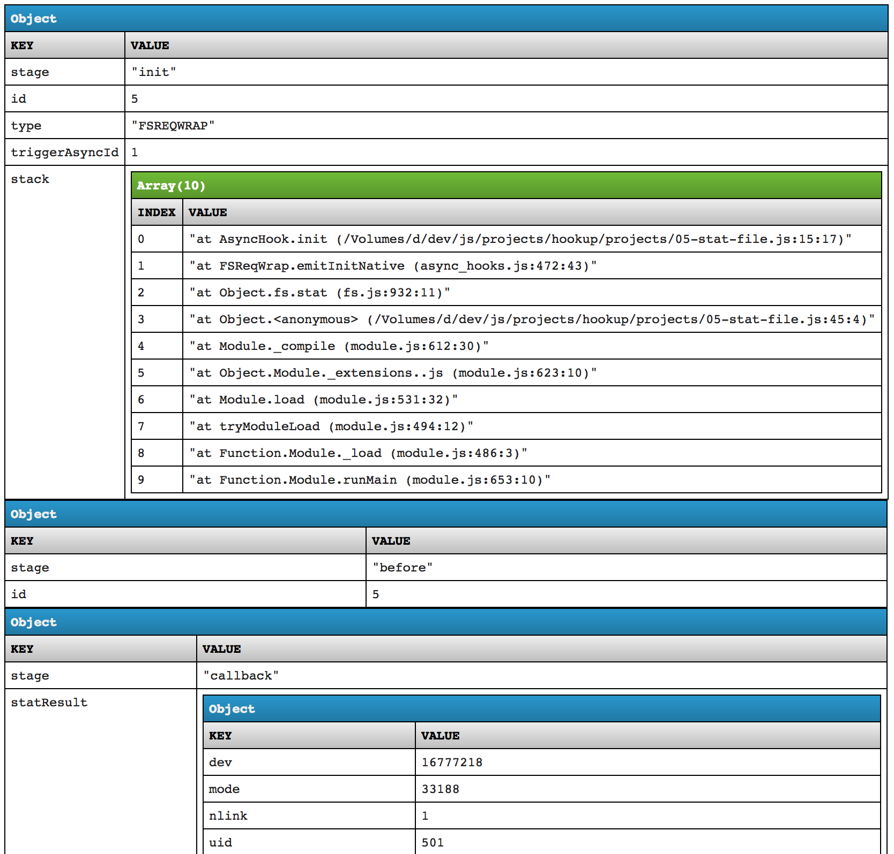

# hookup

Get hooked up with async-hooks to gain insight into your Node.js applications.

<!-- START doctoc generated TOC please keep comment here to allow auto update -->
<!-- DON'T EDIT THIS SECTION, INSTEAD RE-RUN doctoc TO UPDATE -->
**Table of Contents**  *generated with [DocToc](https://github.com/thlorenz/doctoc)*

- [Getting Started](#getting-started)
- [Running a Project](#running-a-project)
  - [Changing the Output Format](#changing-the-output-format)
    - [HTML](#html)
    - [JSON](#json)
- [Inspecting a Project](#inspecting-a-project)

<!-- END doctoc generated TOC please keep comment here to allow auto update -->



## Getting Started

```sh
git clone https://github.com/thlorenz/hookup
cd hookup && npm install
```

## Running a Project

npm scripts to run projects have been provided in order to ensure you are running them with **Node.js version 8 or higher**. This
is necessary to ensure the _async-hooks_ feature is available.

To run a project use the `test` script, i.e. for the first project do:

```sh
npm test projects/01-init.timer.js
```

Alternatively (if you're sure that your Node.js version is current enough -- check via `node -v`) you can just run the
projects directly with your `node` executable.

```sh
node projects/01-init.timer.js
```

### Changing the Output Format

By default all data is output to the console, but for all exercises but the first one you can change that to either html
or JSON (I personally find the html result most readable).

#### HTML

To produce an html file do one of the following:

```sh
npm run html projects/02-init.timer-enable-late.js
```

or

```sh
node projects/02-init.timer-enable-late.js --html
```

Then open `./result.html` in your browser of choice.

#### JSON

To produce a json file do one of the following:

```sh
npm run json projects/02-init.timer-enable-late.js
```

or

```sh
node projects/02-init.timer-enable-late.js --json
```

Then open `./result.json` in your editor of choice.

## Inspecting a Project

If you're having trouble or just are interested in how things work under the hood, you can run each project in _inspect_
mode as follows.

```sh
npm run inspect projects/01-init.timer.js
```

or, using your executable

```sh
node --inspect-brk projects/01-init.timer.js
```

For more information please read [these docs](https://nodejs.org/en/docs/inspector).

I also encourage you to launch Chrome DevTools in any tab and look for the Node.js icon in the upper left corner ;).
That allows you to launch a dedicated DevTools for Node.js.
